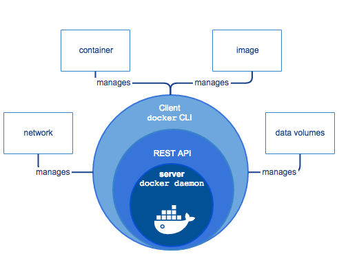

# 1. 介绍

## 什么就 Docker?

Docker 是一个开源项目， 诞生于 2013 年初，最初是 dotCloud 公司内部的一个业余项目。它基于 Google 公司推出的 Go 语言实现。项目后来加入了 Linux 基金会，遵从了 Apache 2.0 协议，项目代码在[GitHub](https://github.com/docker) 上进行维护。

Docker 项目的目标是实现轻量级的操作系统虚拟化解决方案。Docker 的基础是 Linux 容器（LXC）等技术。在 LXC 的基础上 Docker 进行了进一步的封装，让用户不需要去关心容器的管理，使得操作更为简便。用户操作 Docker 的容器就像操作一个快速轻量级的虚拟机一样简单。

## 为什么要使用 Docker?

Docker 相比传统虚拟机有诸多优势。

* 启动速度更快： 秒级启动。
* 快速的部署和交付： 开发者可以使用一个标准的镜像来构建一套开发容器，开发完成之后， 运维人员可以直接使用这个容器来部署代码。
* 更高效的虚拟化： 它是内核级的虚拟化，因此可以实现更高的性能和效率。
* 高效的迁移： Docker 可以运行在不同的平台，用户可以轻松的将一个应用从一个平台迁移到另一个平台。
* 节省开支： Docker 容器除了运行其中应用外，基本不消耗额外的系统资源，一台设备可以运行上千个容器。

## Docker 引擎

docker 引擎是一个 c/s 结构的应用，主要组件见下图：

* Server 是一个常驻进程
* REST API 实现了 client 和 server 间的交互协议
* CLI 实现容器和镜像的管理，为用户提供统一的操作界面

### Docker 构架

Docker 使用 C/S 架构，Client 通过接口与 Server 进程通信实现容器的构建，运行和发布。client 和 server 可以运行在同一台集群，也可以通过跨主机实现远程通信。

## Docker 基本概念

Docker 包括三个基本概念

* 镜像（Image）

Docker 提供了一个很简单的机制来创建镜像或者更新现有的镜像，用户甚至可以直接从其他人那里下载一个已经做好的镜像来直接使用。镜像可以用来创建 Docker 容器。

* 容器（Container）

容器是从镜像创建的运行实例。它可以被启动、开始、停止、 删除。每个容器都是相互隔离的、保证安全的平台。

* 仓库（Repository）

仓库是集中存放镜像文件的场所。仓库分为公开仓库（Public）和私有仓库（Private） 两种形式。

最大的公开仓库是 [Docker Hub](https://hub.docker.com/)，存放了数量庞大的镜像供用户下载。 [中国官方镜像加速](https://www.docker-cn.com/registry-mirror)

