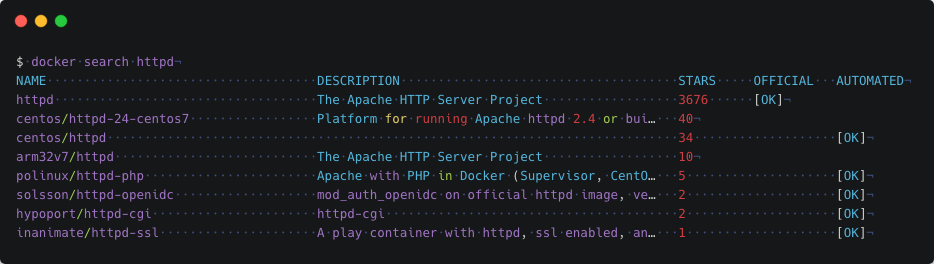

# 3. Dcoker 镜像

Docker 运行容器前需要本地存在对应的镜像，如果镜像不存在本地， Docker 会从镜像仓库下载（默认是 Docker Hub 公共注册服务器中的仓库）。

Docker Hub:[https://hub.docker.com](https://hub.docker.com/)

阿里云镜像：[https://dev.aliyun.com/search.html](https://dev.aliyun.com/search.html)

灵雀云：[https://hub.alauda.cn/](https://hub.alauda.cn/)

## 3-1. 列出镜像列表

我们可以使用 **docker images** 来列出本地主机上的镜像。

```shell
$ sudo docker images
REPOSITORY TAG IMAGE ID CREATED SIZE
ubuntu 14.04 90d5884b1ee0 5 days ago 188 MB
php 5.6 f40e9e0f10c8 9 days ago 444.8 MB
nginx latest 6f8d099c3adc 12 days ago 182.7 MB
mysql 5.6 f2e8d6c772c0 3 weeks ago 324.6 MB
httpd latest 02ef73cf1bc0 3 weeks ago 194.4 MB
ubuntu 15.10 4e3b13c8a266 4 weeks ago 136.3 MB
hello\-world latest 690ed74de00f 6 months ago 960 B
```

各个选项说明:

- **REPOSITORY：**表示镜像的仓库源
- **TAG：**镜像的标签
- **IMAGE ID：**镜像 ID（唯一）
- **CREATED：**镜像创建时间
- **SIZE：**镜像大小

## 3-2. 查找镜像

我们可以从 Docker Hub 网站来搜索镜像，Docker Hub 网址为： "[https://hub.docker.com/](https://hub.docker.com/)"

我们也可以使用 docker search 命令来搜索镜像。比如我们需要一个 httpd 的镜像来作为我们的 web 服务。我们可以通过 docker search 命令搜索 httpd 来寻找适合我们的镜像。



各个选项说明:

- **NAME:**镜像仓库源的名称
- **DESCRIPTION:**镜像的描述
- **OFFICIAL:**是否 docker 官方发布

## 3-3. 拖取镜像

我们决定使用上图中的 httpd 官方版本的镜像，使用命令 docker pull 来下载镜像。

```shell
$ docker pull httpd
Using default tag: latest
latest: Pulling from library/httpd
8b87079b7a06: Pulling fs layer
a3ed95caeb02: Download complete
0d62ec9c6a76: Download complete
a329d50397b9: Download complete
ea7c1f032b5c: Waiting
be44112b72c7: Waiting
```

下载完成后，我们就可以使用这个镜像了。

`$ docker run httpd`
