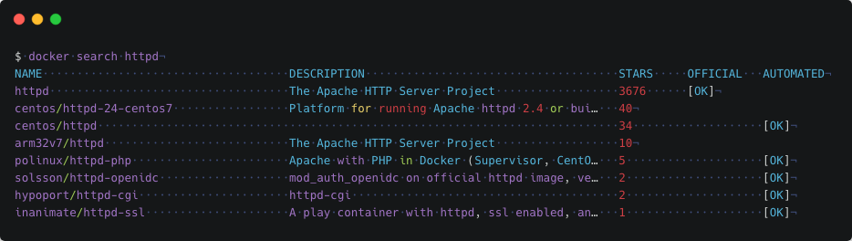

# 1. Docker 介绍

## 什么就 Docker?

---

Docker 是一个开源项目， 诞生于 2013 年初，最初是 dotCloud 公司内部的一个业余项目。它基于 Google 公司推出的 Go 语言实现。项目后来加入了 Linux 基金会，遵从了 Apache 2.0 协议，项目代码在[GitHub](https://github.com/docker) 上进行维护。

Docker 项目的目标是实现轻量级的操作系统虚拟化解决方案。Docker 的基础是 Linux 容器（LXC）等技术。在 LXC 的基础上 Docker 进行了进一步的封装，让用户不需要去关心容器的管理，使得操作更为简便。用户操作 Docker 的容器就像操作一个快速轻量级的虚拟机一样简单。

## 为什么要使用 Docker?

---

Docker 相比传统虚拟机有诸多优势。

- 启动速度更快： 秒级启动。
- 快速的部署和交付： 开发者可以使用一个标准的镜像来构建一套开发容器，开发完成之后， 运维人员可以直接使用这个容器来部署代码。
- 更高效的虚拟化： 它是内核级的虚拟化，因此可以实现更高的性能和效率。
- 高效的迁移： Docker 可以运行在不同的平台，用户可以轻松的将一个应用从一个平台迁移到另一个平台。
- 节省开支： Docker 容器除了运行其中应用外，基本不消耗额外的系统资源，一台设备可以运行上千个容器。

## Docker 引擎

---

docker 引擎是一个 c/s 结构的应用，主要组件见下图：

?imageUrl=https%3A%2F%2Fcubox.pro%2Fc%2Ffilters%3Ano_upscale%28%29%3FimageUrl%3Dhttp%3A%2F%2Fhainiubl.com%2Fimages%2F2016%2Fengine-components-flow.png>)

- Server 是一个常驻进程
- REST API 实现了 client 和 server 间的交互协议
- CLI 实现容器和镜像的管理，为用户提供统一的操作界面

### Docker 构架

---

Docker 使用 C/S 架构，Client 通过接口与 Server 进程通信实现容器的构建，运行和发布。client 和 server 可以运行在同一台集群，也可以通过跨主机实现远程通信。

?imageUrl=https%3A%2F%2Fcubox.pro%2Fc%2Ffilters%3Ano_upscale%28%29%3FimageUrl%3Dhttp%3A%2F%2Fhainiubl.com%2Fimages%2F2016%2Farchitecture.jpg>)

## Docker 基本概念

---

Docker 包括三个基本概念

- 镜像（Image）

Docker 提供了一个很简单的机制来创建镜像或者更新现有的镜像，用户甚至可以直接从其他人那里下载一个已经做好的镜像来直接使用。镜像可以用来创建 Docker 容器。

- 容器（Container）

容器是从镜像创建的运行实例。它可以被启动、开始、停止、 删除。每个容器都是相互隔离的、保证安全的平台。

- 仓库（Repository）

仓库是集中存放镜像文件的场所。仓库分为公开仓库（Public）和私有仓库（Private） 两种形式。

最大的公开仓库是 [Docker Hub](https://hub.docker.com/)，存放了数量庞大的镜像供用户下载。 [中国官方镜像加速](https://www.docker-cn.com/registry-mirror)
# 3. Dcoker 镜像

Docker 运行容器前需要本地存在对应的镜像，如果镜像不存在本地， Docker 会从镜像仓库下载（默认是 Docker Hub 公共注册服务器中的仓库）。

Docker Hub:[https://hub.docker.com](https://hub.docker.com/)

阿里云镜像：[https://dev.aliyun.com/search.html](https://dev.aliyun.com/search.html)

灵雀云：[https://hub.alauda.cn/](https://hub.alauda.cn/)

## 3-1. 列出镜像列表

我们可以使用 **docker images** 来列出本地主机上的镜像。

```shell
$ sudo docker images
REPOSITORY TAG IMAGE ID CREATED SIZE
ubuntu 14.04 90d5884b1ee0 5 days ago 188 MB
php 5.6 f40e9e0f10c8 9 days ago 444.8 MB
nginx latest 6f8d099c3adc 12 days ago 182.7 MB
mysql 5.6 f2e8d6c772c0 3 weeks ago 324.6 MB
httpd latest 02ef73cf1bc0 3 weeks ago 194.4 MB
ubuntu 15.10 4e3b13c8a266 4 weeks ago 136.3 MB
hello\-world latest 690ed74de00f 6 months ago 960 B
```

各个选项说明:

- **REPOSITORY：**表示镜像的仓库源
- **TAG：**镜像的标签
- **IMAGE ID：**镜像 ID（唯一）
- **CREATED：**镜像创建时间
- **SIZE：**镜像大小

## 3-2. 查找镜像

我们可以从 Docker Hub 网站来搜索镜像，Docker Hub 网址为： "https://hub.docker.com/"

我们也可以使用 docker search 命令来搜索镜像。比如我们需要一个 httpd 的镜像来作为我们的 web 服务。我们可以通过 docker search 命令搜索 httpd 来寻找适合我们的镜像。


各个选项说明:

- **NAME:**镜像仓库源的名称
- **DESCRIPTION:**镜像的描述
- **OFFICIAL:**是否 docker 官方发布

## 3-3. 拖取镜像

我们决定使用上图中的 httpd 官方版本的镜像，使用命令 docker pull 来下载镜像。

```shell
$ docker pull httpd
Using default tag: latest
latest: Pulling from library/httpd
8b87079b7a06: Pulling fs layer
a3ed95caeb02: Download complete
0d62ec9c6a76: Download complete
a329d50397b9: Download complete
ea7c1f032b5c: Waiting
be44112b72c7: Waiting
```

下载完成后，我们就可以使用这个镜像了。

`$ docker run httpd`
# 4. Dcoker 容器

简单的说，容器是独立运行的一个或一组应用，以及它们的运行态环境。 如果把镜像看成面向对象中的 类 的话，那么容器就是 类 的实例化 对象。

## 启动容器

启动容器有两种方式，一种是基于镜像新建一个容器并启动， 另外一个是将在终止状态（stopped）的容器重新启动。

通过`docker run` 命令来启动容器。

查看运行帮助：
`$ sudo docker run --help`

下面的命令输出一个 “Hello World”，之后终止容器。

```shell
$ docker run ubuntu /bin/echo "hello world"
hello world
```

这跟在本地直接执行 `/bin/echo 'hello world'`几乎感觉不出任何区别。只不过，这里的输入是由通过 ubuntu 容器执行。

下面进入到 ubuntu 容器中。

```shell
$ docker run -t -i ubuntu /bin/bash
root@543a324ea841:/#
```

- \-t 选项让 Docker 分配一个伪终端（pseudo-tty）并绑定到容器的标准输入上。
- \-i 则让容器的标准输入保持打开。

此时，你已经在 ubuntu 容器中了。这是一个独立的 ubuntu 系统。通过 root@543a324ea841 标识可以看出。

当利用`docker run` 来创建容器时，Docker 在后台运行的标准操作包括：

- 检查本地是否存在指定的镜像，不存在就从公有仓库下载
- 利用镜像创建并启动一个容器
- 分配一个文件系统，并在只读的镜像层外面挂载一层可读写层
- 从宿主主机配置的网桥接口中桥接一个虚拟接口到容器中去
- 从地址池配置一个 IP 地址给容器
- 执行用户指定的应用程序
- 执行完毕后容器被终止

退出容器，可以使用 exit 命令。

```shell
root@543a324ea841:/# exit
exit
```

### 守护状态运行

更多的时候，需要让 Docker 容器在后台以守护态（Daemonized）形式运行。

```shell
$ sudo docker run -d ubuntu /bin/echo "hello docker"
839fee657bfe893b9b2c76aebbb2b620efefc091a04fd90b1c5eda82b9e36730
```

- \-d 表示容器以守护态（Daemonized）形式运行。

### 查看容器

通过 `docker ps` 命令查看当前运行的所有容器。

```shell
$ sudo docker ps -a

CONTAINER ID    IMAGE         COMMAND                  CREATED         STATUS                         PORTS    NAMES
839fee657bfe    ubuntu        "/bin/echo 'hello do…"   About a minute ago Exited (0) About a minute ago        musing_golick
543a324ea841    ubuntu        "/bin/bash"              6 minutes ago   Exited (0) About a minute ago           relaxed_shannon
578639b30db9    ubuntu        "/bin/bash"              7 minutes ago   Exited (0) 7 minutes ago                sad_ritchie
9797d4bcb1f6    ubuntu        "/bin/echo 'hello wo…" 9 minutes ago Exited (0) 9 minutes ago cranky_keller 4d2cd63632c7 hello-world "/hello" 20 minutes ago Exited (0) 20 minutes ago keen_stallman
```

### 获取容器的输出信息

通过`docker logs`命令。

```shell
$ sudo docker logs musing_golick
hello docker

$ sudo docker logs 839fee657bfe
hello docker
```

`musing_golick` 为容器的 NAMES , `839fee657bfe` 为容器的 ID。通过 `docker ps -a` 命令查看。

### 停止容器

可以使用`docker stop`来终止一个运行中的容器。

```shell
docker stop 0fc49a885fc2
```

### 重动容器

可以使用`docker start` 重动容器。

```shell
docker start 0fc49a885fc2
```

### 删除容器

通过 `docker rm` 删除指定的容器。

```shell
docker rm 0fc49a885fc2
```

0fc49a885fc2 为容器有 ID 。

## 运行一个 web 应用

---

使用 docker 构建一个 web 应用程序。

我们将在 docker 容器中运行一个 Python Flask 应用来运行一个 web 应用。

runoob@runoob:~# docker pull training/webapp \# 载入镜像 runoob@runoob:~# docker run \-d \-P training/webapp python app.py


参数说明:

- **\-d:**让容器在后台运行。
- **\-P:**将容器内部使用的网络端口映射到我们使用的主机上。

---

### 查看 WEB 应用容器

使用 docker ps 来查看我们正在运行的容器：

$ docker ps CONTAINER ID IMAGE COMMAND ... PORTS d3d5e39ed9d3 training/webapp "python app.py" ... 0.0.0.0:32769\->5000/tcp

这里多了端口信息。

PORTS 0.0.0.0:32769\->5000/tcp

Docker 开放了 5000 端口（默认 Python Flask 端口）映射到主机端口 32769 上。

这时我们可以通过浏览器访问 WEB 应用


我们也可以通过 -p 参数来设置不一样的端口：

$ docker run \-d \-p 5000:5000 training/webapp python app.py

**docker ps**查看正在运行的容器

$ docker ps CONTAINER ID IMAGE PORTS NAMES bf08b7f2cd89 training/webapp ... 0.0.0.0:5000\->5000/tcp wizardly_chandrasekhar d3d5e39ed9d3 training/webapp ... 0.0.0.0:32769\->5000/tcp xenodochial_hoov

容器内部的 5000 端口映射到我们本地主机的 5000 端口上。

---

### 网络端口的快捷方式

通过 **docker ps** 命令可以查看到容器的端口映射，**docker** 还提供了另一个快捷方式 **docker port**，使用 **docker port** 可以查看指定 （ID 或者名字）容器的某个确定端口映射到宿主机的端口号。

上面我们创建的 web 应用容器 ID 为 **bf08b7f2cd89** 名字为 **wizardly_chandrasekhar**。

我可以使用 docker port bf08b7f2cd89 或 docker port wizardly_chandrasekhar 来查看容器端口的映射情况。

$ docker port bf08b7f2cd89 5000/tcp \-> 0.0.0.0:5000

$ docker port wizardly_chandrasekhar 5000/tcp \-> 0.0.0.0:5000

---

### 查看 WEB 应用程序日志

docker logs \[ID 或者名字\] 可以查看容器内部的标准输出。

$ docker logs \-f bf08b7f2cd89 \* Running on http://0.0.0.0:5000/ (Press CTRL+C to quit) 192.168.239.1 \- \- \[09/May/2016 16:30:37\] "GET / HTTP/1.1" 200 \- 192.168.239.1 \- \- \[09/May/2016 16:30:37\] "GET /favicon.ico HTTP/1.1" 404 \-

**\-f:** 让 **docker logs** 像使用 **tail -f** 一样来输出容器内部的标准输出。

从上面，我们可以看到应用程序使用的是 5000 端口并且能够查看到应用程序的访问日志。

---

### 查看 WEB 应用程序容器的进程

我们还可以使用 docker top 来查看容器内部运行的进程

$ docker top wizardly_chandrasekhar UID PID PPID ... TIME CMD root 23245 23228 ... 00:00:00 python app.py

---

### 检查 WEB 应用程序

使用 **docker inspect** 来查看 Docker 的底层信息。它会返回一个 JSON 文件记录着 Docker 容器的配置和状态信息。

$ docker inspect wizardly_chandrasekhar \[ { "Id": "bf08b7f2cd897b5964943134aa6d373e355c286db9b9885b1f60b6e8f82b2b85", "Created": "2018-09-17T01:41:26.174228707Z", "Path": "python", "Args": \[ "app.py" \], "State": { "Status": "running", "Running": true, "Paused": false, "Restarting": false, "OOMKilled": false, "Dead": false, "Pid": 23245, "ExitCode": 0, "Error": "", "StartedAt": "2018-09-17T01:41:26.494185806Z", "FinishedAt": "0001-01-01T00:00:00Z" }, ......

---

### 停止 WEB 应用容器

$ docker stop wizardly_chandrasekhar wizardly_chandrasekhar

---

### 重启 WEB 应用容器

已经停止的容器，我们可以使用命令 docker start 来启动。

$ docker start wizardly_chandrasekhar wizardly_chandrasekhar

docker ps -l 查询最后一次创建的容器：

$ docker ps -l CONTAINER ID IMAGE PORTS NAMES bf08b7f2cd89 training/webapp ... 0.0.0.0:5000\->5000/tcp wizardly_chandrasekhar

正在运行的容器，我们可以使用 docker restart 命令来重启

---

### 移除 WEB 应用容器

我们可以使用 docker rm 命令来删除不需要的容器

$ docker rm wizardly_chandrasekhar wizardly_chandrasekhar

删除容器时，容器必须是停止状态，否则会报如下错误

$ docker rm wizardly_chandrasekhar Error response from daemon: You cannot remove a running container bf08b7f2cd897b5964943134aa6d373e355c286db9b9885b1f60b6e8f82b2b85. Stop the container before attempting removal or force remove

[查看原网页: www.cnblogs.com](https://www.cnblogs.com/zhuochong/p/10058438.html)
